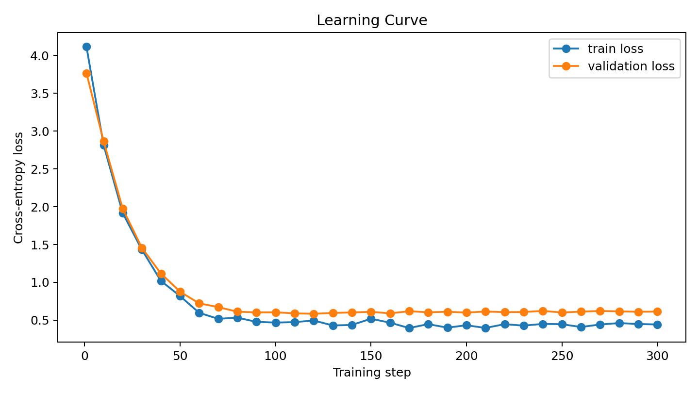
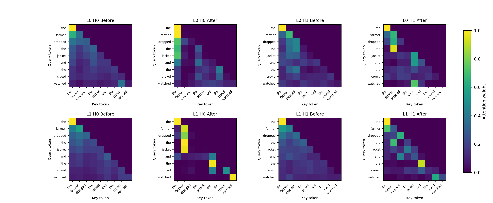
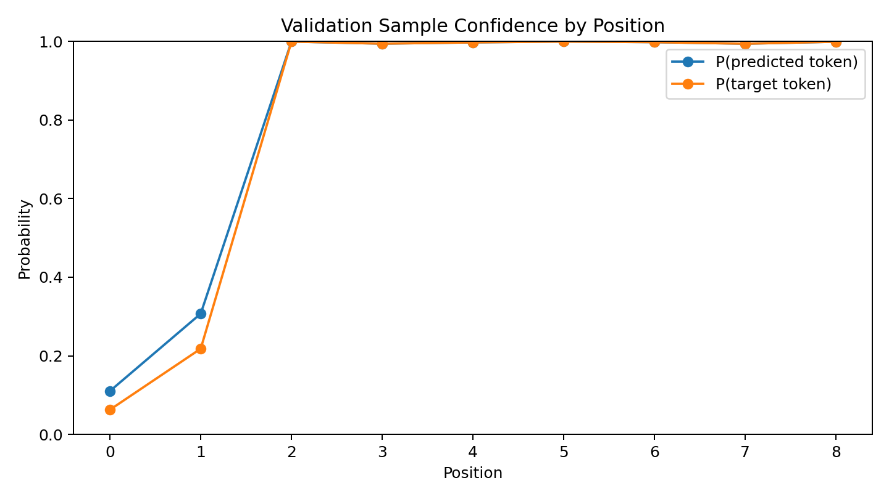
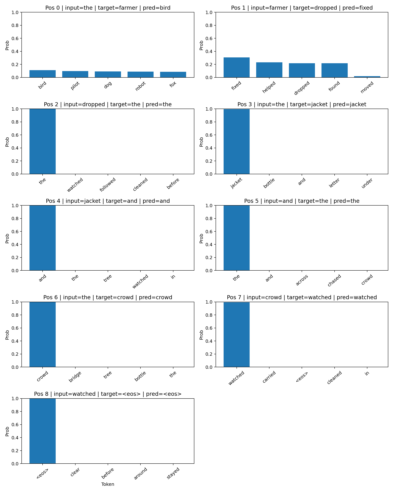
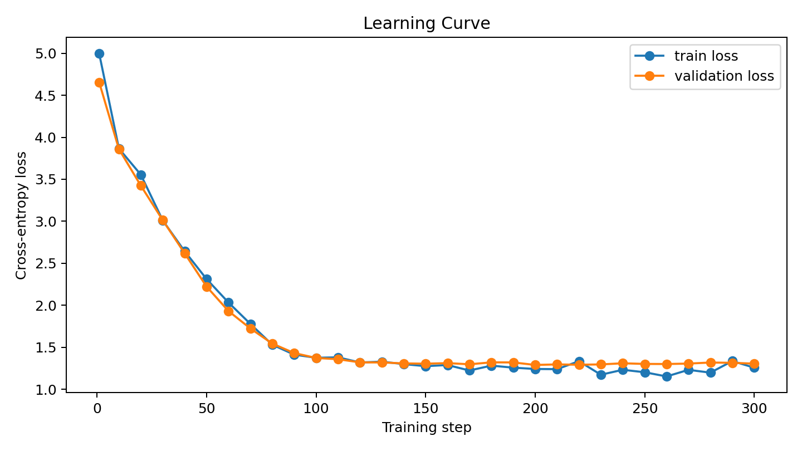
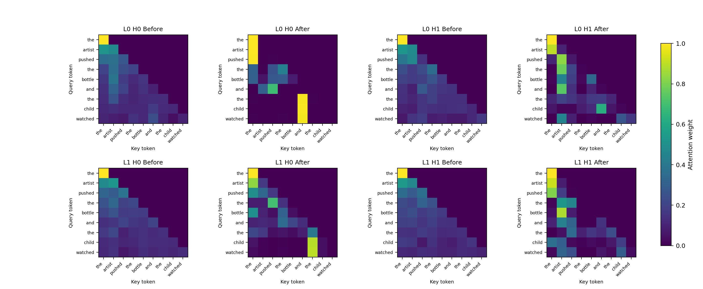
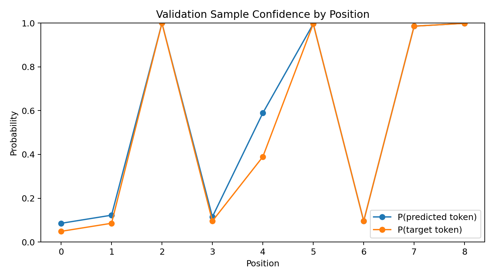
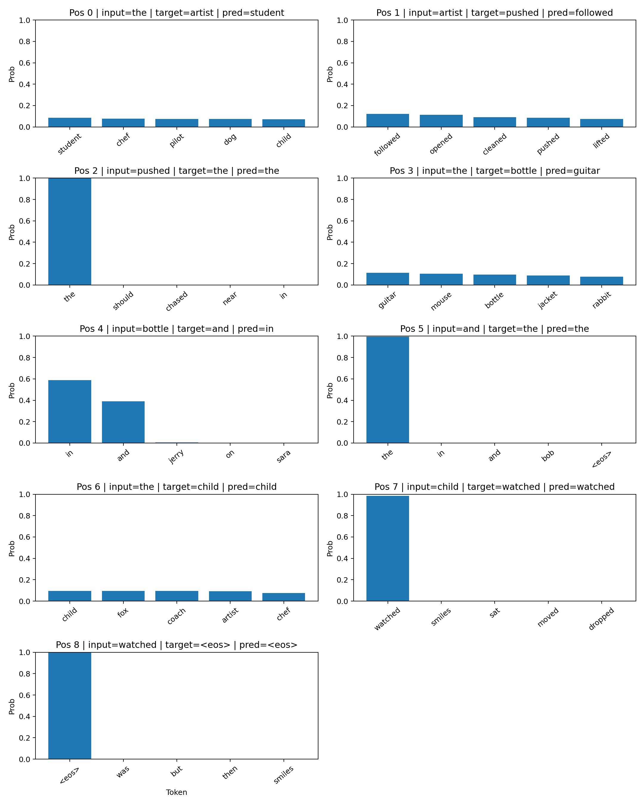

# Transformer From Scratch

This project builds a compact decoder-only Transformer from scratch and uses small, interpretable experiments to explain:

- token embeddings and positional encoding
- masked self-attention and multi-head attention
- transformer block flow (attention -> residual/norm -> feedforward -> residual/norm)
- next-token training on both a toy single sequence and a small corpus

## Repository Structure

- `model/`
  - core model components (`attention.py`, `multi_head_attention.py`, `feedforward.py`, `transformer_block.py`, `tiny_transformer.py`)
  - corpus trainer (`train.py`)
- `data/`
  - synthetic corpora (`synthetic_corpus_100.txt`, `synthetic_corpus_1000.txt`, one sentence per line)
- `utils/`
  - helper visualisation scripts
  - `positional_encoding_viz.py` for positional encoding plots
  - `generate_training_artifacts.py` for training/validation artefacts
- `diagrams/`
  - architecture markdown diagrams
  - generated PNG artefacts (positional encoding and training visuals)

## End-to-End Training Process (Corpus Training)

The corpus trainer lives in `model/train.py`. At a high level:

1. Load corpus lines and tokenise each sentence.
2. Split sentences into train/validation subsets.
3. Build vocabulary from train set and add special tokens:
   - `<pad>` for padding
   - `<eos>` for sequence termination
   - `<unk>` for out-of-vocabulary tokens
4. Encode each sentence to IDs and append `<eos>`.
5. Build next-token pairs per sentence:
   - `input_ids = ids[:-1]`
   - `target_ids = ids[1:]`
6. Create mini-batches by sampling train examples.
7. Pad sequences in each batch to equal length.
8. Build attention mask:
   - causal lower-triangular mask
   - key-side padding mask (prevents attending to `<pad>`)
9. Forward pass through `TinyTransformer` to get logits.
10. Compute cross-entropy loss with `ignore_index=<pad>`.
11. Backpropagate and update parameters with Adam.
12. Periodically evaluate validation loss.
13. Decode one validation sample at the end for qualitative inspection.

## Visualising Learning

This repo compares two training experiments:

### Experiment A: 100-sentence corpus (`synthetic_corpus_100.txt`)

Artefacts: `diagrams/training_artifacts/`  
Config: `300` steps, batch size `16`, eval every `10`

Latest run summary:

- sentences: `100` (`80` train / `20` val)
- vocab size: `56`
- train loss: `4.116868 -> 0.443114` (step `1` to `300`)
- val loss: `3.767409 -> 0.613924` (step `1` to `300`)
- sample token accuracy: `0.777778`

Key insights:

- The model learns quickly because sentence patterns are highly repetitive.
- Validation loss plateaus around `~0.6` while train loss keeps improving, indicating mild overfitting on a small corpus.
- Predictions are very confident for common scaffolding tokens (`the`, `and`, `<eos>`).

&nbsp;

Validation sequence comparison preview (first 5 rows):

| example_index | correct_full_sequence | predicted_full_sequence | next_token_accuracy | full_exact_match |
| --- | --- | --- | --- | --- |
| 0 | the dog helped the basket and the crowd watched | the bird moved the basket and the crowd watched | 0.777778 | 0 |
| 1 | the farmer dropped the jacket and the crowd watched | the bird fixed the jacket and the crowd watched | 0.777778 | 0 |
| 2 | the nurse chased the kite in the garden while the sky stayed clear | the bird watched the kite inside the garden | 0.692308 | 0 |
| 3 | the bird moved the book before sunset | the bird dropped the book before sunset | 0.857143 | 0 |
| 4 | the dog found the basket and the crowd watched | the bird moved the basket and the crowd watched | 0.777778 | 0 |

&nbsp;






### Experiment B: 1000-sentence corpus (`synthetic_corpus_1000.txt`)

Artefacts: `diagrams/training_artifacts_1000/`  
Config: `300` steps, batch size `32`, eval every `10`

Latest run summary:

- sentences: `1000` (`800` train / `200` val)
- vocab size: `128`
- train loss: `4.995986 -> 1.257914` (step `1` to `300`)
- val loss: `4.654333 -> 1.306028` (step `1` to `300`)
- sample token accuracy: `0.555556`
- validation `<unk>` rate (seed `42`, val ratio `0.2`): `0.0000`

Key insights:

- The task is harder (larger data + larger vocabulary), so absolute loss is higher than Experiment A.
- Train and validation losses track closely, showing better generalisation with more data.
- Confidence is concentrated on structural tokens, while content-token prediction remains less certain.

&nbsp;

Validation sequence comparison preview (first 5 rows):

| example_index | correct_full_sequence | predicted_full_sequence | next_token_accuracy | full_exact_match |
| --- | --- | --- | --- | --- |
| 0 | the artist pushed the bottle and the child watched | the student followed the guitar in the child watched | 0.555556 | 0 |
| 1 | because the teacher was steady the artist carried the plant | because the robot was loud the pilot opened the mouse | 0.500000 | 0 |
| 2 | anna told noah that noah should close the basket | anna told tom that noah should push the mouse | 0.666667 | 0 |
| 3 | the chef moved the puzzle in the station | the student sat the guitar and the workshop | 0.375000 | 0 |
| 4 | when the bird carried the kite the mechanic dropped the book | when the child moved the guitar the teacher opened the guitar | 0.454545 | 0 |

&nbsp;






For each experiment, these files are generated:

- `learning_curve.png`: train/validation loss progression
- `attention_before_after.png`: all layers x heads before vs after training
- `validation_confidence.png`: position-wise `P(pred)` vs `P(target)` on one validation sample
- `validation_topk_positions.png`: top-k token distributions for all positions in one validation sample
- `validation_predictions.csv`: token-level predictions and correctness
- `validation_sequence_comparison.csv`: one row per validation example with full correct vs predicted sequence
- `loss_history.csv`: numeric logged losses
- `run_summary.txt`: run metadata and summary metrics

## Generate Artefacts (Reproducible)

Run from repository root (`transformer-from-scratch/`).

### 1) Experiment A (100 sentences)

```bash
python -m utils.generate_training_artifacts \
  --corpus-path data/synthetic_corpus_100.txt \
  --output-dir diagrams/training_artifacts \
  --num-steps 300 \
  --batch-size 16 \
  --learning-rate 0.01 \
  --val-ratio 0.2 \
  --eval-every 10 \
  --seed 42 \
  --d-model 16 \
  --num-heads 2 \
  --d-ff 64 \
  --num-layers 2 \
  --sample-index 1 \
  --top-k 5
```

Outputs in `diagrams/training_artifacts/`:

- `learning_curve.png`
- `attention_before_after.png`
- `validation_confidence.png`
- `validation_topk_positions.png`
- `validation_predictions.csv`
- `validation_sequence_comparison.csv`
- `loss_history.csv`
- `run_summary.txt`

### 2) Experiment B (1000 sentences)

```bash
python -m utils.generate_training_artifacts \
  --corpus-path data/synthetic_corpus_1000.txt \
  --output-dir diagrams/training_artifacts_1000 \
  --num-steps 300 \
  --batch-size 32 \
  --learning-rate 0.01 \
  --val-ratio 0.2 \
  --eval-every 10 \
  --seed 42 \
  --d-model 16 \
  --num-heads 2 \
  --d-ff 64 \
  --num-layers 2 \
  --sample-index 0 \
  --top-k 5
```

Outputs in `diagrams/training_artifacts_1000/`:

- `learning_curve.png`
- `attention_before_after.png`
- `validation_confidence.png`
- `validation_topk_positions.png`
- `validation_predictions.csv`
- `validation_sequence_comparison.csv`
- `loss_history.csv`
- `run_summary.txt`

## Troubleshooting

- `NaN` losses:
  - ensure attention mask does not fully mask query rows.
  - current implementation masks padding keys, not query rows.
- `ModuleNotFoundError: torch`:
  - install PyTorch in your environment first.
- shape/assertion errors for heads:
  - ensure `d_model % num_heads == 0`.
