# Multi-Head Attention

```mermaid
flowchart LR

    %% Row 1
    A("INPUT x<br/>────────────<br/>(B, S, d_model)"):::input
    B("Q, K, V PROJECTION<br/>────────────<br/>(B, S, d_model)"):::linear
    C("SPLIT HEADS<br/>────────────<br/>(B, H, S, d_k)"):::reshape
    D("ATTENTION SCORES<br/>────────────<br/>(B, H, S, S)"):::attention
    M("APPLY MASK<br/>────────────<br/>(B, 1, S, S)"):::mask
    E("SOFTMAX (WEIGHTS)<br/>────────────<br/>(B, H, S, S)"):::softmax

    %% Row 2
    F("WEIGHTED SUM (APPLY V)<br/>────────────<br/>(B, H, S, d_k)"):::attention
    G("COMBINE HEADS<br/>────────────<br/>(B, S, d_model)"):::reshape
    H("FINAL LINEAR (W_o)<br/>────────────<br/>(B, S, d_model)"):::linear
    I("OUTPUT<br/>────────────<br/>(B, S, d_model)"):::output

    %% Flow
    A --> B --> C --> D --> M --> E
    E --> F --> G --> H --> I

    %% Styles
    classDef input fill:#E3F2FD,stroke:#1E88E5,color:#000,stroke-width:2px;
    classDef linear fill:#FFF3E0,stroke:#FB8C00,color:#000,stroke-width:2px;
    classDef reshape fill:#E1F5FE,stroke:#039BE5,color:#000,stroke-width:2px;
    classDef attention fill:#EDE7F6,stroke:#5E35B1,color:#000,stroke-width:2px;
    classDef softmax fill:#FCE4EC,stroke:#D81B60,color:#000,stroke-width:2px;
    classDef mask fill:#ECEFF1,stroke:#546E7A,color:#000,stroke-width:2px;
    classDef output fill:#FFEBEE,stroke:#E53935,color:#000,stroke-width:2px;
```

## Legend

- `B` = batch size
- `S` = sequence length
- `d_model` = embedding / model dimension
- `H` = number of attention heads
- `d_k` = per-head key/query/value dimension (`d_model / H`)

## Multi-Head Attention Breakdown

| Block | What it does | Input Shape | Output Shape | What the output represents |
|------|-------------|------------|-------------|---------------------------|
| Input x | Represents the current token representations entering the attention mechanism. Each token already contains semantic and positional information. | (B, S, d_model) | (B, S, d_model) | A batch of token vectors where each token is represented by a d_model-dimensional embedding. |
| Linear Projections (Q, K, V) | Projects each token into three different vector spaces: queries (Q), keys (K), and values (V). These capture different roles in the attention mechanism - what a token is looking for, what it offers, and what information it carries. | (B, S, d_model) | (B, S, d_model) for each of Q, K, V | Three separate representations per token: queries (used to search), keys (used for matching), and values (used for information aggregation). |
| Split Heads | Reshapes the representation into multiple attention heads by splitting the embedding dimension. Each head works on a smaller subspace of size d_k = d_model / H. | (B, S, d_model) | (B, H, S, d_k) | Each token is now represented by H smaller vectors. Each head can learn different types of relationships (e.g. local vs global patterns). |
| Attention Scores | Computes pairwise similarity between tokens by comparing queries and keys. This produces a matrix of scores indicating how much each token should attend to every other token. | (B, H, S, d_k) | (B, H, S, S) | For each head, a matrix where row i shows how strongly token i relates to every token in the sequence. |
| Apply Mask | Applies constraints to the attention scores by setting disallowed positions (e.g. future tokens or padding tokens) to very negative values. This ensures that after softmax, these positions receive zero attention. | (B, H, S, S) + (B, 1, S, S) | (B, H, S, S) | A masked attention score matrix where invalid positions are effectively ignored, enforcing constraints like causal structure or padding exclusion. |
| Softmax (Weights) | Normalises the attention scores into a probability distribution across tokens. This ensures that each token distributes its attention across other tokens in a controlled way. | (B, H, S, S) | (B, H, S, S) | Attention weights where each row sums to 1, representing how much each token attends to others. |
| Weighted Sum (Apply V) | Uses the attention weights to compute a weighted combination of value vectors. This aggregates information from other tokens based on their relevance. | (B, H, S, S) + (B, H, S, d_k) | (B, H, S, d_k) | Each token now contains a mixture of information from other tokens, weighted by attention. |
| Combine Heads | Concatenates all attention heads back together to form a single representation per token. | (B, H, S, d_k) | (B, S, d_model) | A unified representation that combines information from all heads, capturing multiple types of relationships. |
| Final Linear (W_o) | Applies a final linear transformation to mix information across heads and produce the final attention output. | (B, S, d_model) | (B, S, d_model) | A refined token representation where information from different heads has been integrated. |
| Output | Final output of the multi-head attention module, passed to the next stage (e.g. residual connection in the Transformer block). | (B, S, d_model) | (B, S, d_model) | Context-aware token representations that incorporate information from across the sequence. |
