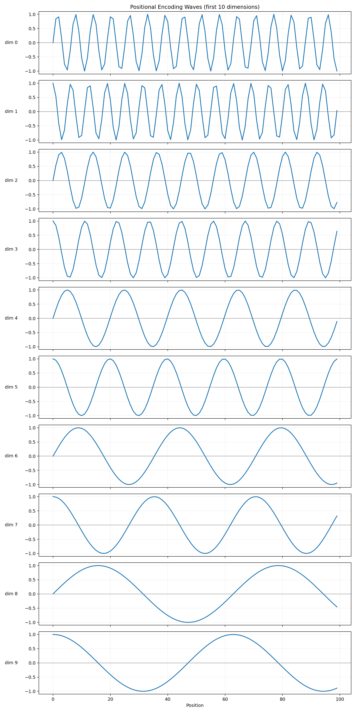
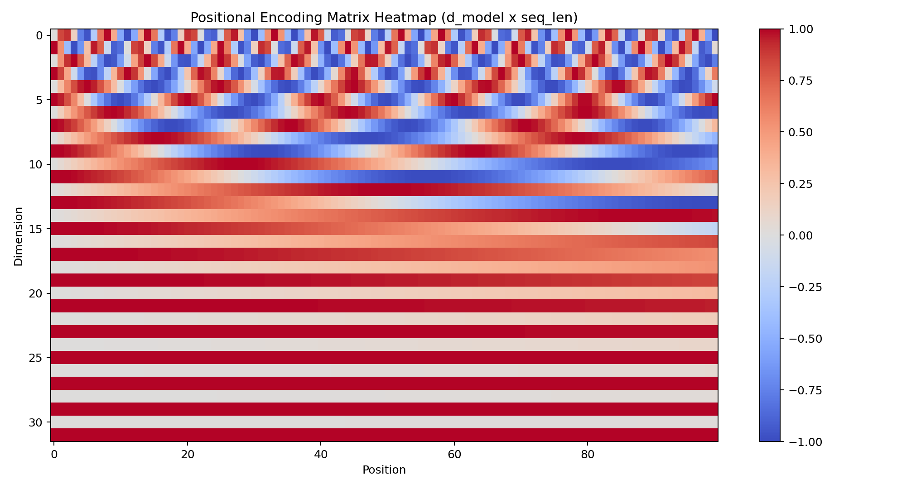

# Positional Encoding

Self-attention can compare token content, but it does not inherently know token order.  
Positional encoding injects order by adding a position-dependent vector to each token embedding.

## Core Equations

```text
PE(pos, 2i)   = sin(pos / 10000^(2i/d_model))
PE(pos, 2i+1) = cos(pos / 10000^(2i/d_model))
```

- Even dimensions use `sin`, odd dimensions use `cos`.
- Each dimension pair `(2i, 2i+1)` is one frequency channel.
- Low-index dimensions oscillate faster; high-index dimensions oscillate slower.

## Wave View (First 10 Dimensions)



Note:
- X-axis = position of the token in a given sequence: `0..99`.
- Each subplot = one embedding dimension.

## Matrix Heatmap View (`d_model x 100`)



Note:
- Rows = dimensions, columns = positions.
- Color = positional encoding value.
- Upper rows show rapid alternating patterns; lower rows vary more gradually.
- Together, all rows form a multi-frequency fingerprint for each position.

## How It Is Used in the Transformer

Positional encoding is added directly to token embeddings. This is a simple elementwise addition that keeps the same shape `(S, d_model)`, but now each token vector carries both token identity and position information.

## Legend

- `S` = sequence length (positions)
- `d_model` = embedding/model dimension
- `pos` = position index
- `i` = sinusoidal frequency-pair index
- `PE` = positional encoding matrix
