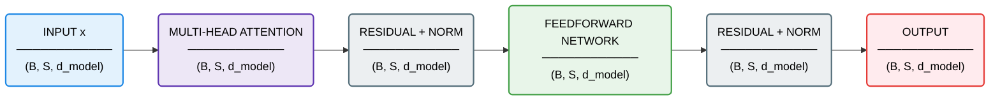

# Transformer Block Architecture

## Transformer Block Breakdown

| Block | What it does | Input Shape | Output Shape | What the output represents |
|------|-------------|------------|-------------|---------------------------|
| Input x | Represents the incoming token representations from the previous layer (or embedding layer for the first block). These already contain semantic and positional information. | (B, S, d_model) | (B, S, d_model) | A set of token vectors where each token has a learned representation, but may not yet fully capture relationships with other tokens. |
| Multi-Head Attention | Allows each token to attend to all other tokens in the sequence (subject to masking). It computes attention weights based on similarity (Q·K) and uses them to aggregate information (via V). Multiple heads enable the model to capture different types of relationships (e.g. syntax, long-range dependencies) in parallel. | (B, S, d_model) | (B, S, d_model) | Each token is updated to incorporate information from other relevant tokens. The representation becomes more context-aware, reflecting interactions such as dependencies or co-occurrence patterns. |
| Add & Norm (after attention) | Adds the original input (residual connection) to the attention output, then applies layer normalization. The residual connection preserves original information and stabilizes gradients, while normalization keeps activations well-scaled during training. | (B, S, d_model) | (B, S, d_model) | A stabilized and enriched representation that combines both the original token information and the context gathered through attention. |
| Feedforward Network | Applies a position-wise fully connected network (typically two linear layers with a non-linearity like ReLU). This transforms each token independently, allowing the model to further process and refine features extracted by attention. | (B, S, d_model) | (B, S, d_model) | Each token’s representation is nonlinearly transformed, enabling the model to learn more complex patterns beyond linear combinations of attended information. |
| Add & Norm (after FFN) | Again applies a residual connection followed by layer normalization. This ensures stability and allows the model to build deeper representations without degrading earlier learned features. | (B, S, d_model) | (B, S, d_model) | A refined and stable token representation that combines attention-based context and feedforward transformation. |
| Output | Final output of the Transformer block, which is passed to the next block (or to the output layer if this is the last block). | (B, S, d_model) | (B, S, d_model) | Fully contextualized token representations where each token encodes both its own meaning and its relationships with other tokens in the sequence. |