# Transformer Architecture (Decoder Only) Overview

## End-to-End Flow

```mermaid
flowchart LR

    A("TOKEN IDs<br/>────────────<br/>(B, S)"):::input
    B("EMBEDDING<br/>────────────<br/>(B, S → B, S, d_model)"):::embedding
    C("POSITIONAL ENCODING<br/>────────────<br/>(B, S, d_model)"):::pos
    D("TRANSFORMER BLOCK × N<br/>────────────<br/>(B, S, d_model)"):::transformer
    E("LINEAR PROJECTION<br/>────────────<br/>(B, S → B, S, vocab_size)"):::projection
    F("LOGITS<br/>────────────<br/>(B, S, vocab_size)"):::logits

    A --> B --> C --> D --> E --> F

    %% Styles
    classDef input fill:#E3F2FD,stroke:#1E88E5,color:#000,stroke-width:2px;
    classDef embedding fill:#FFF3E0,stroke:#FB8C00,color:#000,stroke-width:2px;
    classDef pos fill:#E8F5E9,stroke:#43A047,color:#000,stroke-width:2px;
    classDef transformer fill:#F3E5F5,stroke:#8E24AA,color:#000,stroke-width:2px;
    classDef projection fill:#FFFDE7,stroke:#FDD835,color:#000,stroke-width:2px;
    classDef logits fill:#FFEBEE,stroke:#E53935,color:#000,stroke-width:2px;
```

## Legend

- `B` = batch size
- `S` = sequence length
- `d_model` = embedding / model dimension
- `vocab_size` = number of unique tokens in the vocabulary

## Component Breakdown

| Block | What it does | Input Shape | Output Shape | What the output represents |
|------|-------------|------------|-------------|---------------------------|
| Token IDs | Represents each token as a discrete integer index corresponding to an entry in the vocabulary. This is the raw, symbolic form of the input sequence before any learned representation is applied. | (B, S) | (B, S) | A batch of B sequences, each containing S tokens encoded as integers. At this stage, tokens have no notion of similarity or meaning. |
| Embedding | Maps each token ID to a learned dense vector via a lookup table. This transforms discrete tokens into continuous representations where semantic relationships (e.g. similarity between words) can be captured. | (B, S) | (B, S, d_model) | Each token is now represented by a vector of length d_model. Tokens with similar meanings tend to have similar vectors, enabling the model to reason about semantics rather than raw indices. |
| Positional Encoding | Injects information about the position of each token in the sequence by adding a deterministic (sinusoidal) or learned positional vector to the embedding. This compensates for the fact that attention mechanisms are permutation-invariant. | (B, S, d_model) | (B, S, d_model) | Each token vector now encodes both **what the token is** (semantic meaning) and **where it appears** in the sequence (position), allowing the model to distinguish order-sensitive patterns. |
| Transformer Block × N | Applies a stack of identical blocks, each consisting of multi-head self-attention and a feedforward network, with residual connections and layer normalisation. These blocks iteratively refine token representations by allowing tokens to attend to and incorporate information from other tokens. | (B, S, d_model) | (B, S, d_model) | Contextualized token representations. Each token vector now reflects not only its own meaning, but also relevant information from other tokens in the sequence (e.g. dependencies, relationships, context). |
| Linear Projection | Applies a linear transformation that maps each token representation from the model space (d_model) into a vector of size vocab_size. This prepares the representation for prediction by aligning it with the vocabulary space. | (B, S, d_model) | (B, S, vocab_size) | For each token position, a vector of raw scores (logits) over the entire vocabulary. Each value corresponds to how likely a particular token is as the next token. |
| Logits | Represents the final unnormalised prediction scores produced by the model. These are typically passed through a softmax function during training or inference to obtain probabilities. | (B, S, vocab_size) | (B, S, vocab_size) | For every position in every sequence, a full probability distribution (sums up to 1 after softmax) over possible next tokens. The highest-scoring token is selected as the model’s prediction. |