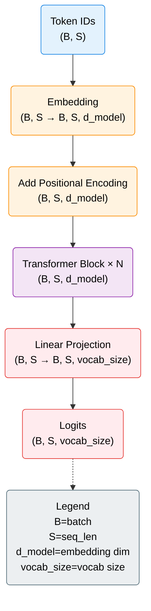

```mermaid
flowchart TD

    A("Token IDs<br/>(B, S)"):::input
    B("Embedding<br/>(B, S → B, S, d_model)"):::embedding
    C("Add Positional Encoding<br/>(B, S, d_model)"):::embedding
    D("Transformer Block × N<br/>(B, S, d_model)"):::transformer
    E("Linear Projection<br/>(B, S → B, S, vocab_size)"):::output
    F("Logits<br/>(B, S, vocab_size)"):::output

    A --> B --> C --> D --> E --> F

    L("Legend<br/>B=batch<br/>S=seq_len<br/>d_model=embedding dim<br/>vocab_size=vocab size"):::legend
    F -.-> L

    %% Styles
    classDef input fill:#E3F2FD,stroke:#1E88E5,color:#000;
    classDef embedding fill:#FFF3E0,stroke:#FB8C00,color:#000;
    classDef transformer fill:#F3E5F5,stroke:#8E24AA,color:#000;
    classDef output fill:#FFEBEE,stroke:#E53935,color:#000;
    classDef legend fill:#ECEFF1,stroke:#546E7A,color:#000;
```